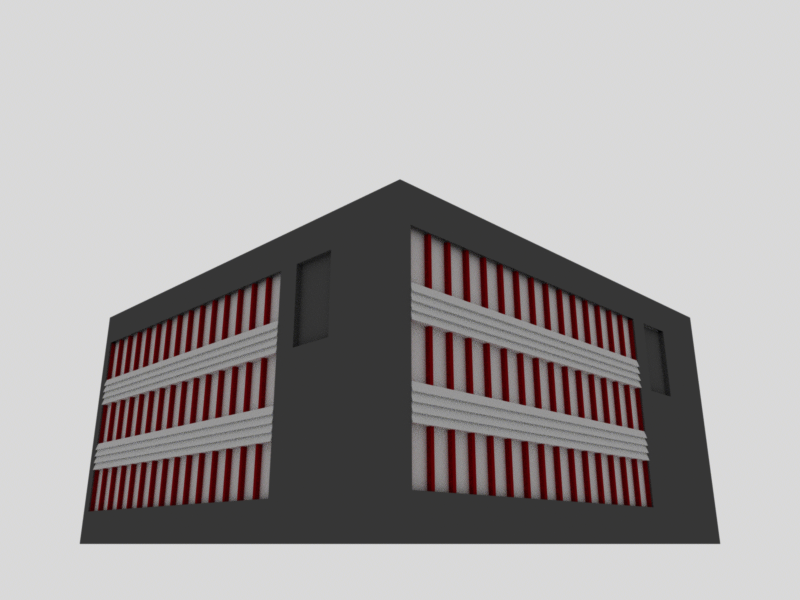

# Beryllbygget (PBRT Project)

This project reproduces a part of the NTNU (Norwegian University of Science and Technology) campus, focusing on the **Beryllbygget** building, using the physically based renderer **[PBRT](https://pbrt.org/)**.  
It was developed as part of a school assignment on computer graphics and physically based rendering.

  
  

